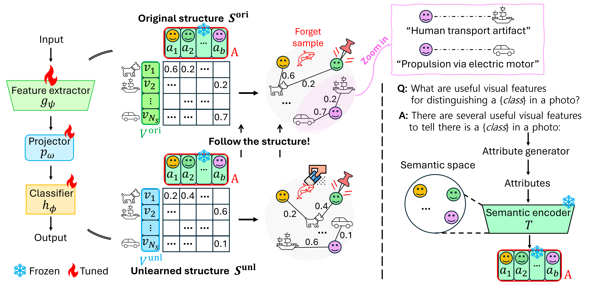

## Stake the Points: Structure-Faithful Instance Unlearning [CVPR 2026]

**[Stake the Points: Structure-Faithful Instance Unlearning](https://openaccess.thecvf.com/content/CVPR2026/papers/Hong_Stake_the_Points_Structure-Faithful_Instance_Unlearning_CVPR_2026_paper.pdf)**  
*Kiseong Hong, JungKyoo Shin, Eunwoo Kim*  
IEEE/CVF Conference on Computer Vision and Pattern Recognition (CVPR), 2026





## Abstract
Machine unlearning (MU) addresses privacy risks in pretrained models. The main goal of MU is to remove the influence of designated data while preserving the utility of retained knowledge. Achieving this goal requires preserving semantic relations among retained instances, which existing studies often overlook. We observe that without such preservation, models suffer from progressive structural collapse, undermining both the deletion–retention balance. In this work, we propose a novel structure-faithful framework that introduces stakes, i.e., semantic anchors that serve as reference points to maintain the knowledge structure. By leveraging these anchors, our framework captures and stabilizes the semantic organization of knowledge. Specifically, we instantiate the anchors from language-driven attribute descriptions encoded by a semantic encoder (e.g., CLIP). We enforce preservation of the knowledge structure via structure-aware alignment and regularization: the former aligns the organization of retained knowledge before and after unlearning around anchors, while the latter regulates updates to structure-critical parameters. Results from image classification, retrieval, and face recognition show average gains of 32.9%, 22.5%, and 19.3% in performance, balancing the deletion–retention trade-off and enhancing generalization.


---
## Environment & Setup

```bash
conda create -n structguard python=3.9 -y
conda activate structguard

pip install -r requirements.txt
```

> **Note**  
> All experiments were conducted under this environment.  
> Minor version differences may lead to slightly different results.

---

## Pretrained Models
The repository includes pretrained checkpoints for:

- CIFAR-10
  - ResNet-18
  - ResNet-50

- CIFAR-100
  - ResNet-18
  - ResNet-50

All checkpoints can be found under:
pretrained_models/

---

## Supported Unlearning Algorithms

This repository supports four machine unlearning algorithms. Running the provided training script produces results for all four methods, including our method.

- **Baseline 1:** NegGrad
- **Baseline 2:** Adv
- **Baseline 3:** L2UL
- **Baseline 4:** StructGuard (Ours)

For the detailed formulation and implementation of each unlearning algorithm, please refer to our paper.

---

## Training

Training can be launched by running the provided bash script.

```bash
bash run_unlearn_cifar10.sh
bash run_unlearn_cifar100.sh
```

Each baseline uses its own hyperparameter configuration. Please check the corresponding bash file before running experiments.

> **Note**  
> Performance may vary depending on the hardware, software environment, and random seed.  
> If the results differ from the reported values, we recommend tuning `pgd_eps` and `lr`.

---

## Results

After training, the results are automatically saved as follows:

- **Training logs** for all four unlearning algorithms, including StructGuard, are saved under the `logs/` directory.
- **Unlearned model checkpoints** are saved under the directory specified by `save_dir`.

The saved logs include the training progress and evaluation results for each unlearning method.

---

## Acknowledgements

This repository is built upon the codebase of **[Learning to Unlearn: Instance-wise Unlearning for Pre-trained Classifiers](https://arxiv.org/pdf/2301.11578)**. The description generation process used for anchor construction is based on **[Visual Classification via Description from Large Language Models](https://arxiv.org/pdf/2210.07183)**. We gratefully acknowledge the authors of both works for their valuable contributions.

The provided descriptions can also be modified or newly generated. Users are welcome to construct their own descriptions using any preferred language model or description-generation pipeline.

---

## Citation

If you find our work useful for your research, please cite our paper:

```bibtex
@inproceedings{hong2026stake,
  title={Stake the Points: Structure-Faithful Instance Unlearning},
  author={Hong, Kiseong and Shin, JungKyoo and Kim, Eunwoo},
  booktitle={Proceedings of the IEEE/CVF Conference on Computer Vision and Pattern Recognition},
  pages={24524--24533},
  year={2026}
}
```

---
